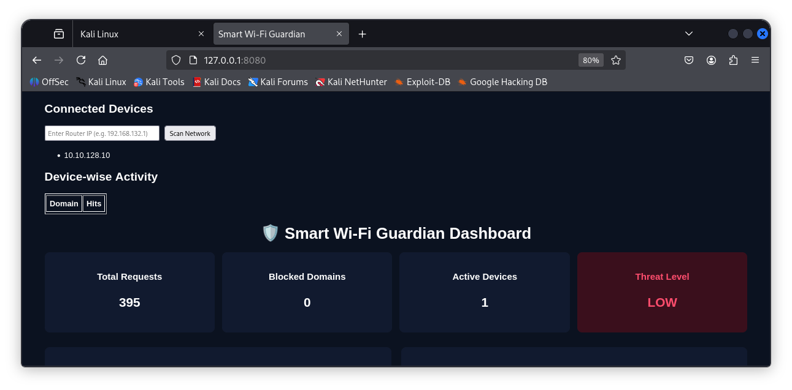

# 🔐 Smart Wi-Fi Guardian

Smart Wi-Fi Guardian is a Python & Flask-based network security monitoring system designed to
automatically discover connected devices on a Wi-Fi network, analyze their traffic behavior,
and present real-time insights through an interactive dashboard.

This project focuses on **network visibility, device behavior analysis, and security awareness**
for local networks.

---

## 🚀 Key Features

- 📡 **Automatic Network Discovery**
  - ARP-based scanning to detect all devices connected to a router
  - Dynamic device list without manual IP entry

- 🖥️ **Device-Wise Activity Monitoring**
  - Per-device tracking of visited domains
  - Drill-down view for each connected IP

- 📊 **Real-Time Dashboard**
  - Auto-refreshing statistics using REST APIs
  - Live visualization of network usage and trends

- ⚠️ **Threat / Risk Awareness**
  - Device-level risk indicators based on domain activity patterns
  - Foundation for intrusion detection and policy enforcement

- 🌐 **RESTful API Architecture**
  - Modular API endpoints (`/api/stats`, `/api/scan`)
  - Clean separation of backend logic and frontend UI

---

## 🛠️ Technology Stack

- **Programming Language:** Python 3  
- **Backend Framework:** Flask  
- **Frontend:** HTML, CSS, JavaScript  
- **Networking Tools:** ARP Scan  
- **Platform:** Linux (Kali Linux compatible)  
- **Version Control:** Git & GitHub  

---

## 🏗️ System Architecture

The system follows a modular client-server architecture:

- Frontend dashboard communicates with backend APIs
- Backend performs network scanning and data processing
- Results are exposed via REST endpoints and rendered dynamically

(See architecture diagram below)

---

## 📸 Dashboard Preview




---

## ▶️ How to Run

```bash
export PYTHONPATH=$(pwd)/src
python3 src/dashboard/app.py

