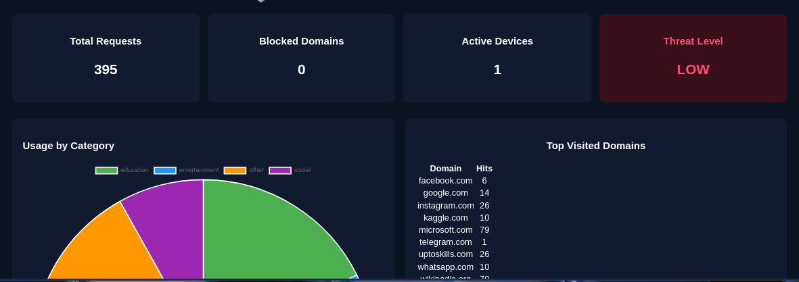

## 🎯 Why Smart Wi-Fi Guardian?
This project was built to explore real-time network visibility, device behavior tracking,
and security analytics for local Wi-Fi networks using lightweight tools.

Smart Wi-Fi Guardian
===================

A passive Wi-Fi intrusion detection system (WIDS) that detects:
- Evil Twin Access Points
- Deauthentication Flood Attacks
- ARP Spoofing

This project focuses on detection, logging, and alerts only.
No packet injection or active attacks are performed.

# 🔐 Smart Wi-Fi Guardian

Smart Wi-Fi Guardian is a Flask-based network monitoring dashboard designed to scan local networks, track connected devices, and analyze domain-level activity for potential threats.

## 🚀 Features
- 📡 Network scanning (ARP-based)
- 🖥️ Connected device monitoring
- 📊 Real-time dashboard statistics
- 🔒 Threat level assessment
- 🌐 REST API (`/api/stats`, `/api/scan`)

## 🛠 Tech Stack
- Python 3
- Flask
- HTML / CSS / JavaScript
- Linux (Kali compatible)

## 📂 Project Structure

## 📸 Dashboard Preview

